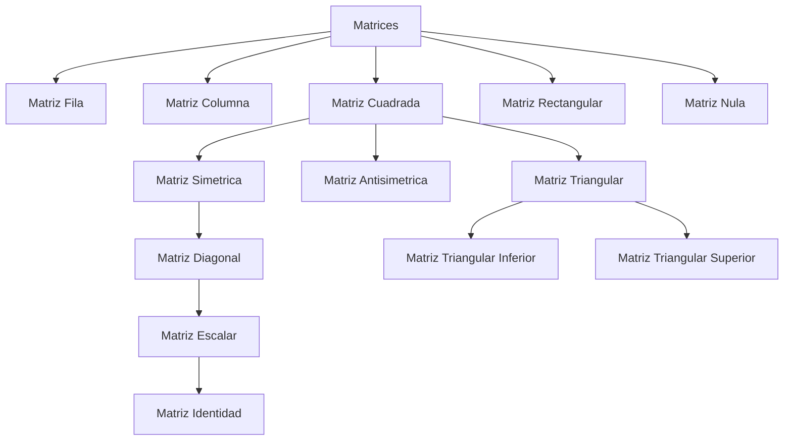

# Título 1
## Título 2
### Título
![[Paradigma]]

![[Paradigma#Titulo2]]
CTRL + MOUSE para previsualizar una nota.

> Esto es una cita

**Negrilla**
*Cursiva*
- Lista 
1. Lista ordenada (Se pueda acompañar con tabs)
- [ ] Lista de tareas
--- 
Aquí va a ir un texto ==Resaltado== 

Tablas:
|Nombre|Salario|
|--------|-------|
| Juan | $1950 |
| Laura | $2450 
| Federico |$1580 |

Para que no compile:
\*\*Negrita

